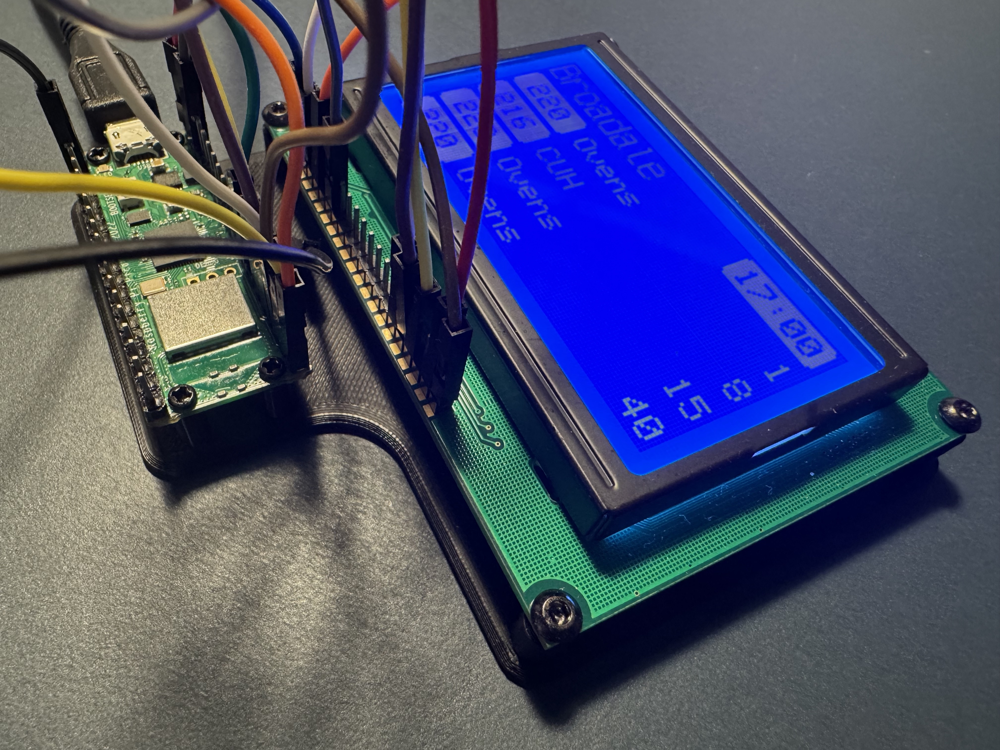

# 3D Models

This folder contains the 3D models used for this project.

## Prototyping Mount

This board is only needed during prototyping, to keep the the Pico and Display together.
The display uses M3x8 machine screws to affix. The Pi Pico is using M2x6 self-tap screws.

[lcd_display_128x64_pi_pico_carrier.stl](./prototyping_board/lcd_display_128x64_pi_pico_carrier.stl)

